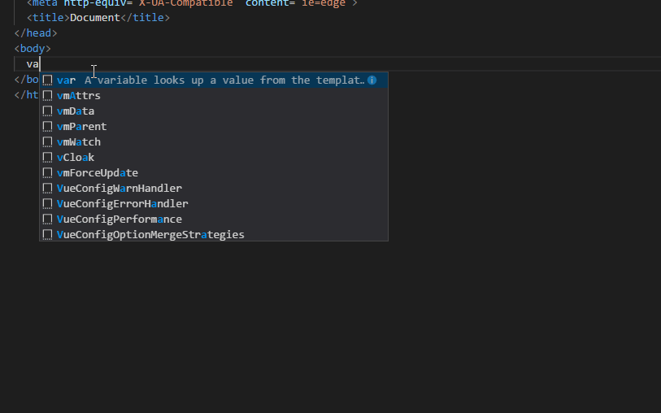

## Usages

### Snippets

| Prefix      | HTML Snippet Content                             |
| ----------- | ------------------------------------------------ |
| `block`     | ` `                |
| `njk`       | ``                                          |
| `var`       | `{{ variable }}`                                 |
| `extends`   | ``                       |
| `include`   | ``                       |
| `filter`    | ` `            |
| `for`       | ` `        |
| `asyncEach` | ` ` |
| `asyncAll`  | ` `  |
| `if`        | ` `                 |
| `ife`       | `if else`                                        |
| `ifel`      | `if elif`                                        |
| `elif`      | `elif`                                           |
| `else`      | `else`                                           |
| `set`       | `set`                                            |
| `macro`     | `macro`                                          |
| `import`    | `import`                                         |
| `from`      | `from import`                                    |
| `raw`       | `raw`                                            |
| `call`      | `call`                                           |
| `var`       | `alt variable`                                   |
| `super`     | `super`                                          |
| `or`        | `or`                                             |
| `pipe`      | `pipe`                                           |
